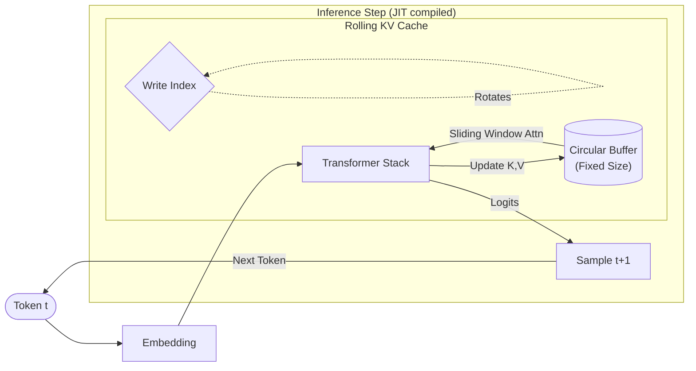

# rolling_kv_jax

A minimal, production-oriented JAX inference engine demonstrating a rolling (circular) KV cache, sliding-window causal attention, and a JIT-compatible autoregressive decode loop. This repository focuses on inference-time mechanics (not training) and is designed to show how modern LLM inference engines manage bounded memory, masking, and streaming generation in pure JAX.

---

## TL;DR

- **Rolling KV cache:** fixed-size circular buffer for keys/values (constant memory)
- **Sliding-window causal attention:** banded lower-triangular mask to limit attention to recent context
- **JIT-compatible decode loop:** device-side autoregressive generation using `jax.lax.scan`
- **Pure functional JAX:** immutable updates, PyTree parameter structures, CPU-compatible

---

## Features

- **Multi-layer Transformer** — compact, modular implementation of transformer inference.
- **Rolling (circular) KV cache** — keeps a fixed memory footprint and overwrites oldest entries.
- **Sliding-window causal attention** — attention restricted to a recent window to enable long-running streaming.
- **JIT-compatible decode** — uses `jax.lax.scan` to keep the autoregressive loop on-device.
- **PyTree-based parameters** — parameters are stored as nested dicts/lists for easy traversal by JAX.
- **CPU-friendly** — no device-specific dependencies; suitable for experimentation and study.

---

## Design Overview

This project demonstrates core patterns used by production JAX inference pipelines:

- Keep the model pure and functional (no in-place mutation).
- Represent parameters as PyTrees so JAX utilities work seamlessly.
- Use a circular KV buffer to bound memory usage for long-running streams.
- Restrict attention to a sliding window so compute and memory remain constant per step.
- Implement the decode loop using `jax.lax.scan` so the loop can be JIT-compiled.

### Architecture Diagram




### Rolling KV Cache

Instead of allowing the KV cache to grow indefinitely, we maintain a circular buffer:

```
[ t0 t1 t2 t3 t4 t5 t6 t7 t8 ... ]  ->  [ t6 t7 t8 t9 ]
```

Key ideas:

- `write_index`: where the next keys/values are written (wraps around)
- `used`: how many positions are currently filled
- `total_tokens`: absolute position counter for global position inference
- Immutable `.at[].set()` updates ensure functional behavior

See `model/cache.py` for the core implementation.

### Sliding-window Causal Attention

Attention is allowed only when both conditions hold:

- pos_j <= pos_i (causality)
- pos_j > pos_i - `max_cache_len` (within sliding window)

This yields a banded lower-triangular mask. See `utils/masks.py`.

---

## Project Structure

```
rolling_kv_jax/
├── main.py                 # Demo: streaming generation
├── config.py               # ModelConfig dataclass
├── model/
│   ├── cache.py            # Rolling KV cache
│   ├── attention.py        # Attention + sliding-window masking
│   ├── transformer_block.py# Single transformer block
│   ├── transformer.py      # Full multi-layer transformer
│   ├── params.py           # Parameter initialization
│   └── rope.py             # (Optional) RoPE positional encoding
├── inference/
│   ├── prefill.py          # Prompt prefill
│   ├── decode.py           # Single-step decode
│   └── generate.py         # `lax.scan` autoregressive loop
├── utils/
│   ├── masks.py            # Sliding-window masking helpers
│   └── tree_utils.py       # PyTree helpers
└── tests/                  # Unit tests for cache, masking, decode, streaming
```

---

## Installation

Install JAX (CPU) and dependencies:

```bash
pip install jax jaxlib
pip install -r requirements.txt  # optional, if you add other helpers
```

> CPU is sufficient for exploring the code and behavior.

---

## Running the Demo

Run the demo to initialize parameters, create the rolling cache, and generate tokens autoregressively:

```bash
python main.py
```

The demo shows generation with the rolling cache wrapping and the sliding-window attention in effect.

---

## Running Tests

Run the unit tests with `pytest`:

```bash
pytest tests/
```

Tests cover cache rollover correctness, masking logic, decode stability, and streaming beyond `max_cache_len`.

---

## Why This Project Exists

Modern LLM inference engines must handle long-running streaming conversations without allowing the KV cache to grow indefinitely. This project is a compact, readable demonstration of how to build a constant-memory, JIT-compatible inference engine in pure JAX that mirrors many production patterns (rolling cache, sliding-window attention, device-side loops).

---

## Future Extensions

- RoPE positional encoding (full support)
- Batched decoding and prefill optimizations
- Flash-attention style memory layout
- Multi-device `pjit` sharding and speculative decoding

---

## Contributing

Contributions welcome. When opening PRs, please:

- Keep code functional and JIT-compatible (no side-effects).
- Add tests for new behavior.
- Keep changes focused and documented.

---

## License

MIT

